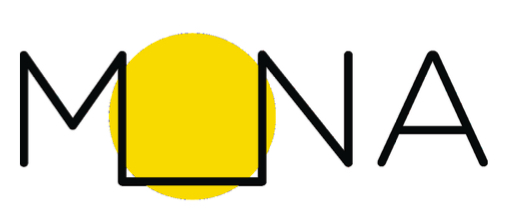

# Vue d'ensemble du projet

!!! info "Informations générales"
**Session**: Hiver 2026  
 **Auteur(s)**: Anissa Ould ferroukh<!-- Nom de chaque membre (matricule)  -->  
 **Thème(s)**: Médiation culturelle, valorisation de l’art public, innovation culturelle et numérique<!-- Thèmes principaux abordés dans le projet  -->  
 **Superviseur(s)**: Guy Lapalme<!-- Nom du superviseur (affiliation)  -->  
 **Collaborateur(s):** Maison MONA et partenaires culturels/communautaires<!-- Nom de(s) collaborateur(s) et partenaire(s)` -->

## Description du projet

<!-- > :bulb: N'oubliez pas d'effacer ou mettre en commentaires les notes (`>`) en début de section  -->

### Contexte

<!-- > Présentez le contexte général dans lequel s’inscrit votre projet (social, organisationnel, technologique, éducatif, environnemental, etc.). -->

{style="display:block; margin: 0 auto; width:30%; height:40%;"}

Le projet s’inscrit dans le contexte de la valorisation du patrimoine culturel et artistique de Montréal à travers des expériences interactives en milieu urbain. La Maison MONA est un organisme à but non lucratif fondé en 2020 qui vise à rendre l’art et le patrimoine accessibles à un large public, notamment par l’entremise d’outils numériques (application mobile) et de parcours de médiation culturelle dans l’espace public.

[MONA](https://monamontreal.org/) collabore avec des établissements scolaires, des institutions culturelles et des organismes communautaires pour proposer des activités participatives qui valorisent œuvres d’art, lieux patrimoniaux et diversité culturelle.

### Problématique

<!-- > Décrivez le problème central ou la question de recherche que votre projet cherche à adresser, pourquoi s'y intéresser et les faiblesses des solutions actuelles.
> Le problème doit pouvoir être compris indépendamment de la solution envisagée. -->

L’accès et la découverte de l’art public et du patrimoine culturel sont souvent limités par des barrières sociales, éducatives et technologiques. Malgré l’abondance d’œuvres et de lieux culturels à Montréal, plusieurs citoyen·ne·s n’ont pas les outils ou les opportunités d’explorer ces richesses de manière engageante. Il existe un manque de médiation interactive et de sensibilisation inclusive qui combine culture, technologie et engagement communautaire.

### Proposition et objectifs

<!-- > Présentez votre proposition de projet et les objectifs visés. Expliquez en quoi votre approche répond à la problématique identifiée.
> Assurez-vous d'avoir, dans la mesure du possible, des objectifs mesurables, raisonnnables dans le temps et non redondants entre eux. -->

L’objectif du projet est de développer et promouvoir une plateforme culturelle numérique et participative (basée sur l’application MONA) ainsi que des parcours de médiation culturelle qui:

- Encourage la découverte et l’appréciation de l’art public et du patrimoine.

- Favorise l’inclusion, l’accessibilité et le dialogue culturel au sein de la population montréalaise.

- Offre des activités éducatives et interactives adaptées à différents publics (grand public, étudiant·e·s, institutions culturelles).

- Mesure l’engagement des utilisateur·rice·s (participation aux parcours, utilisation de l’application, retours qualitatifs).

### Méthodologie

<!-- > Expliquez comment vous comptez aborder le projet : démarche générale, grandes étapes prévues, itérations, types de validations envisagées. -->

La méthodologie adoptée repose sur une approche d’observation, d’analyse et de contribution à un projet existant.

Les principales étapes sont :

- Prise de connaissance du projet MONA : Analyse de la mission, des valeurs, des services offerts et du fonctionnement général de l’organisme et de l’application.

- Analyse des dispositifs existants : Étude des parcours de médiation culturelle, des activités proposées et des outils numériques utilisés pour engager le public.

- Observation des usages et des publics ciblés : Compréhension des types d’utilisateurs, des contextes d’utilisation et des objectifs pédagogiques et culturels visés.

- Analyse critique : Identification des forces, limites et enjeux du projet (accessibilité, clarté, engagement, inclusion).

- Propositions d’amélioration ou pistes de réflexion : Formulation de recommandations ou suggestions réalistes, en cohérence avec la vision et les contraintes du projet existant.

Cette démarche permet de s’inscrire dans une logique de collaboration et d’apprentissage, plutôt que de conception.

### Validation et Évaluation

<!-- > Indiquez comment vous évaluerez que votre solution répond aux objectifs du projet (ex. scénarios d’usage, tests, retours utilisateurs, indicateurs qualitatifs ou quantitatifs). -->

L’évaluation du travail reposera principalement sur :

- La cohérence de l’analyse du projet existant.

- La pertinence des observations et réflexions critiques formulées.

- La qualité des liens établis entre théorie, pratiques observées et objectifs du projet MONA.

- La capacité à proposer des améliorations réalistes et justifiées, même à un niveau conceptuel.

## Équipe

<!-- > Présentez les membres de l’équipe et le rôle principal de chacun dans le projet. -->

- Anissa Ould Ferroukh Développement serveur.
- Camille Delattre Direction des opérations et coordinatrice à la structuration des données
- Camila De Oliveira Savoi Direction de la recherche
- Julie Graff Direction artistique
- Lena Krause Direction technique et fondatrice
- Alexia Pinto Ferretti Direction des publics
- Marguerite Chiarello Responsable des communications et consultante en médiation
- Corélie Godefroid Développement serveur
- Simon Janssen Responsable de l'infrastructure
- Christian Lungescu Développement mobile
- Barbara Marche Designer UI/UX
- David Valentine Consultation en sciences de l'information

## Échéancier

Le suivi complet est disponible dans la page [Suivi de projet](suivi.md).

| Activités                      | Début   | Fin     | Livrable               | Statut      |
| ------------------------------ | ------- | ------- | ---------------------- | ----------- |
| Réunion d'intégration          | 12 jan. | 12 jan. | Notes de compréhention | ✅ Terminé  |
| Analyse / Études préliminaires | 12 jan. | 23 jan. | Document d'analyse     | ✅ Terminé  |
| Développement / Contribution   | 23 jan. | 17 jan. | Modules / Ajouts       | 🔄 En cours |
| Présentation + Rapport         | 17 avr. | 30 avr. | Présentation + Rapport | ⏳ À venir  |
