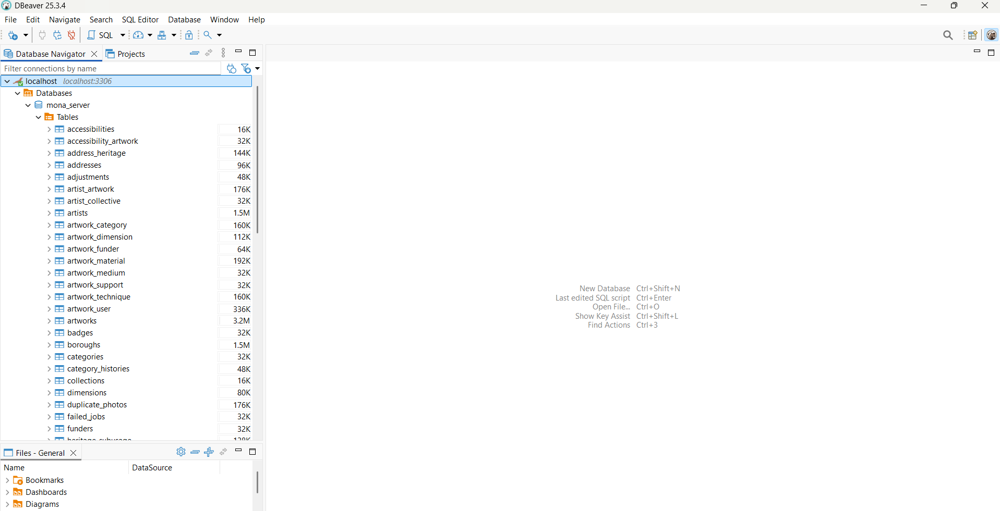
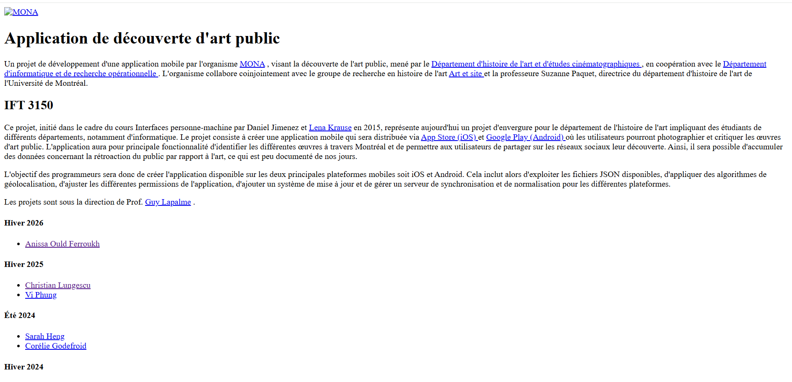
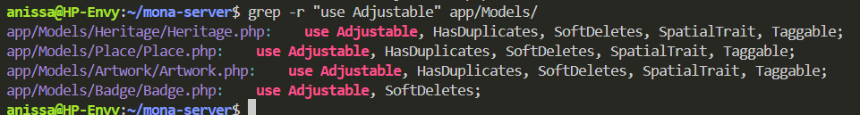
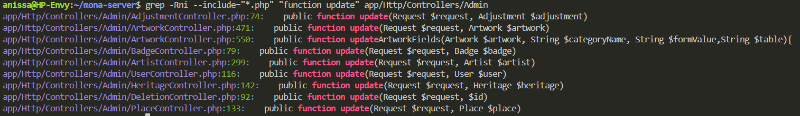
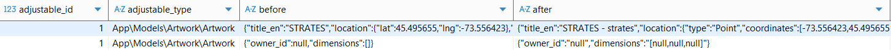

# Suivi de projet

<!-- > :bulb: Cette page documente l’évolution du projet dans le temps.
> Elle sert à rendre visibles les décisions, ajustements et apprentissages.
> Les entrées peuvent être hebdomadaires ou bi-hebdomadaires.
> N'oubliez pas d’effacer ou de mettre en commentaires les notes (`>`) avant la remise finale. -->

---

## **Semaine 1 (12–18 janvier)**

### Objectifs de la période

- Prendre connaissance du projet MONA et de son contexte
- Comprendre l’organisation de l’équipe et les outils utilisés
- S’approprier l’application et les ressources existantes

### Travail réalisé

<!-- !!! abstract "Avancement" - [x] Analyse de solutions existantes - Comparaison de trois outils similaires - [x] Prototype basse fidélité (Figma) - [ ] Validation utilisateur - Reportée à la semaine suivante -->

- Création de la page de suivi afin de consigner les rapports hebdomadaires
- Prise de connaissance de l’historique et de la mission de MONA (lecture du blogue et des rapports existants)
- Découverte et test de l’application MONA en conditions réelles (utilisation sur le terrain)
- Intégration aux outils de communication et de collaboration du projet (Groupe Element, pCloud, Dépôt Git, Figma, MarkDown, TestFlight)
- Rencontre avec Lena pour comprendre le fonctionnement général du projet et de l’équipe
- Rencontre avec Simon pour une présentation du fonctionnement du serveur
- Participation à une réunion avec l’équipe de design et découverte de nouvelles propositions de design

<!-- ### Décisions et ajustements

> À compléter uniquement si des choix structurants ont été faits
> ou si l’orientation du projet a évolué.

!!! info "Décisions" - Abandon de l’approche X jugée trop complexe - Reformulation de la problématique suite aux premières analyses

### Difficultés rencontrées

> À compléter uniquement si des obstacles ont eu un impact réel
> sur l’avancement du projet.

!!! warning "Difficultés" - Problème de configuration du plugin Mermaid - Confusion entre `mkdocs-mermaid2-plugin` (pip)
et `mermaid2` (nom du plugin) - Résolu après nettoyage et configuration correcte dans `mkdocs.yml` -->

## **Semaine 2 (19–25 janvier)**

### Objectifs de la période

- Effectuer l'installation des outils et logiciels nécessaires
- Comprendre l’organisation de l’équipe et les outils utilisés
- Explorer le processus ETL en quoi il pourrait nous servir au sein du projet

### Travail réalisé

<!-- !!! abstract "Avancement" - [x] Analyse de solutions existantes - Comparaison de trois outils similaires - [x] Prototype basse fidélité (Figma) - [ ] Validation utilisateur - Reportée à la semaine suivante -->

- Compléter la page de suivi pour cette semaine concernant les rapports hebdomadaires
- Participation à une réunion avec l’équipe (Weekly Meeting)
- Lecture de la documentation concernant l'architecture du projet sur le Wiki.
- Effectuer l'installation ainsi que la configuration de l'environnement de développement
- Familiarisation avec la librérie Laravel
- Participation à une réunion avec Corélie pour qu'elle puisse m'expliquer l'API **v3** (version la plus récente)
- Recherche sur le modèle ETL et comment les outils OpenRefine ainsi que Apache Airflow peuvent opérer au niveau du processus

Après avoir effectuer ma rechecher j'ai pu organiser mes idées comme suit :

    Cliquer ici pour ouvrir en plein écran

<object
        data="../pdfs/ETL_process_num1.pdf"
        type="application/pdf"
        width="100%"
        height="550">
</object>

## **Semaine 3 (26 janvier - 1er février)**

### Objectifs de la période

- Continuer la recherche sur le processus ETL et son intégration avec le projet MONA
- Trouver des avis sur les deux outils Apache Airflow ainsi que OpenRefine
- Planifier une rencontre avec Simon pour apprendre comment effectuer un déploiement
- Générer la clé ssh publique et la transmettre à Lena pour avoir accès au serveur

### Travail réalisé

<!-- !!! abstract "Avancement" - [x] Analyse de solutions existantes - Comparaison de trois outils similaires - [x] Prototype basse fidélité (Figma) - [ ] Validation utilisateur - Reportée à la semaine suivante -->

- Participation à une réunion avec l’équipe (Weekly Meeting)

- Génération de la clé publique SSH afin d'avoir accès au serveur :
  <ol>
    <li>Il faut d'abord s'assurer que OpenSSH soit installé (Windows 11) : <code>ssh -v</code></li>
    <li>Pour générer sa clé publique il faut taper : <code>ssh-keygen -t ed25519 -C "ton_email@example.com"</code></li>
    <li>Appuyer sur Entrée pour accepter l'emplacement par défaut</li>
    <li>Choisir une passphrase (optionnel)</li>
    <li>Pour récupérer la clé publique : <code>cat ~/.ssh/id_ed25519.pub</code></li>
  </ol>

- Participation à une réunion avec Simon pour me montrer comment effectuer un déploiement au niveau de l'environnement de staging (dev) :
  <ul>
    <li> *Bonne pratique* : créer une branche sur GitHub pour chaque tâche</li>
    <li>
      Étapes du déploiement :
      <ol>
        <li>Dans le terminal taper : <code>ssh picasso</code></li>
        <li>Introduire le mot de passe de la configuration</li>
        <li>
          Accéder au bon repo — pour l’environnement de staging :
          <code>ls docker/dev/mona-server/</code>
        </li>
        <li>Effectuer un <code>git pull</code></li>
      </ol>
    </li>
  </ul>

- J'ai exploré cette semaine quels étaient les avantages et inconvénients de l'utilisation du processus ETL au sein du projet MONA :

  

  

    Cliquer ici pour ouvrir en plein écran
  

  <object data="../pdfs/etl_process_num2.pdf" type="application/pdf" width="100%" height="550"></object>

- _Feedback lors de la réunion hebdomadaire_ : le schéma n’explique pas clairement de quelle façon les deux outils seront utilisés dans le backend pour la migration des données. Je dois donc me familiariser davantage avec le code existant et déterminer comment et où intégrer les packages du processus ETL déjà présent dans Laravel notamment ceux mentionnés dans le premier schéma, puisque l’idée d’utiliser Airflow a été écartée en raison de sa complexité

## **Semaine 4 (02–08 février)**

### Objectifs de la période

- IMPORTANT : Comprendre et se familiariser avec le code côté serveur
- Répondre aux questions suivantes :
  <ol>

  <li> Comment intégrer OpenRefine dans le workfow actuel ? </li>
  <li> Est-ce que le format exporté de OpenRefine correspond à nos besoins?</li>

  </ol>

### Travail réalisé

- Participation à une réunion avec l’équipe (Weekly Meeting)
- Participation à une réunion avec Christian, durant laquelle il m’a présenté une vue d’ensemble du développement mobile, la librairie utilisée (Vue.js) et le processus de release, qui était le sujet principal de notre rencontre. En résumé, une fois la release destinée aux tests effectuée, la mise en production se fait facilement, que ce soit sur l’Apple App Store (iOS) ou sur le Google Play Store (Android).
- Familiarisation et compréhension de mona-server :

**Architecture du projet**

    - app/ : Contient la logique métier de l'application (Modèles, Controllers, Services)

    - routes/ : Définit les routes API et web

    - database/ : Migrations de la base de données

    - resources/ : Vues (Blade, Vue.js) et assets (CSS, JS)

    - public/ : Point d'entrée web de l'application (fichiers publics)

    - config/ : Fichiers de configuration Laravel

    - storage/ : Fichiers générés : logs, cache, uploads

    - tests/ : Tests unitaires et fonctionnels

    - documentation/ : Documentation du projet

- **Vue d'ensemble du dossier app/**

| Dossier       | Rôle principal                                               |
| ------------- | ------------------------------------------------------------ |
| `Console/`    | Commandes Artisan et planification (schedule)                |
| `Exceptions/` | Gestion centralisée des exceptions HTTP                      |
| `Helpers/`    | Fonctions utilitaires (fichiers, photos)                     |
| `Http/`       | Contrôleurs, middleware, validation, ressources API          |
| `Jobs/`       | Tâches asynchrones (imports, nettoyage, mise à jour JSON)    |
| `Mail/`       | Classes d'envoi d'e-mails (réinitialisation mot de passe)    |
| `Models/`     | Modèles Eloquent et logique métier des entités               |
| `Providers/`  | Enregistrement des services et configuration des routes/vues |

**NOTE** : Plus de détails concernant les sous dossiers de app/ sont disponibles ici [Détails](details-app-folders.md)

**Architecture à plusieurs niveaux**
Le projet suit une architecture multi-niveaux :

     - Couche de présentation : Interface web (Vue.js + Blade)
     - Couche de service : API REST (Laravel) — version actuelle : v3 (Hiver 2026)
     - Couche de données : Base de données MySQL

**Fichiers importants**

      - composer.json : Dépendances PHP
      - package.json : Dépendances JavaScript
      - docker-compose.yml : Configuration Docker
      - .env : Variables d'environnement
      - artisan : CLI Laravel pour les commandes de développement

- **Packages ETL et import de données pour Laravel**

**1. Packages ETL (Extract – Transform – Load)**

**marquine/php-etl**

- **Packagist :** `marquine/php-etl`
- Très utilisé (132k+ installs). API fluide pour enchaîner extract → transform → load.
- Intégration Laravel (ServiceProvider), support SQLite, MySQL, PostgreSQL.
- Exemple : `Job::start()->extract('csv', 'file.csv')->transform('trim', ['columns' => ['name']])->load('table', 'users')`.

**LaravelPlus/etl-manifesto**

- **GitHub :** [LaravelPlus/etl-manifesto](https://github.com/laravelplus/etl-manifesto)
- ETL « Laravel-native » déclaratif : tout se définit en **YAML** (sources, transformations, destinations).
- Pas besoin d’écrire de requêtes ou de scripts d’export ; adapté si tu veux des pipelines déclaratifs.

**2. Packages d’import (proches ETL / flux de données)**

**spatie/simple-excel**

- **Packagist :** `spatie/simple-excel`
- Très répandu (millions d’installs). Lecture/écriture Excel et CSV, API simple.
- Utile pour l’« extract » et un peu de « transform » avant d’alimenter ta base (load fait à la main avec Eloquent/DB).
- Compatible Laravel 9–12, PHP 8.3+ sur les versions récentes.

  **laravel-enso/data-import**

- **GitHub :** [laravel-enso/data-import](https://github.com/laravel-enso/data-import)
- Import **XLSX** (box/spout) avec templates, validation, notifications.
- Plutôt « import structuré » que ETL complet, mais couvre bien extract + transform + validation.

  **giftonian/massive-csv-import**

- Import **CSV** avec beaucoup de lignes, basé sur les **Laravel Queues**.
- Adapté aux gros fichiers (millions de lignes), moins « ETL générique » qu’un vrai moteur ETL.

**3. Synthèse**

| Besoin                                                | Package à regarder                                             |
| ----------------------------------------------------- | -------------------------------------------------------------- |
| ETL complet (extract + transform + load) avec API PHP | **marquine/php-etl**                                           |
| ETL déclaratif en YAML, intégré Laravel               | **LaravelPlus/etl-manifesto**                                  |
| Lire/écrire Excel/CSV simplement                      | **spatie/simple-excel**                                        |
| Import XLSX avec validation et templates              | **laravel-enso/data-import**                                   |
| Gros CSV en file d’attente                            | **massive-csv-import** (ou jobs custom comme dans mona-server) |

---

Dans **mona-server**, les imports sont faits avec des **Jobs Laravel** personnalisés (sans package ETL). Si on veut introduire un ETL (sources multiples, transformations réutilisables, config déclarative), **php-etl** ou **etl-manifesto** sont les plus proches ; pour seulement lire des CSV/Excel avant de les insérer en base, **spatie/simple-excel** suffit souvent.

## **Semaine 5 (09–15 février)**

### Objectifs de la période

- Continuer les tâches de la semaine précédante.

### Travail réalisé

- J'ai eu une réunion avec Simon durant laquelle il m'a expliqué comment les migrations fonctionnaient et comment notre base de données est peuplée. En explorant les dossiers du **mona-server** je ne comprenais pas trop pourquoi dans le dossier **database** on avait seulement 3 fichiers de migrations et surtout comment nos données sont importer dans notre base de données. Simon m'a expliqué qu'il devrait y avoir un dossier migrations sur Github non disponible pour l'instant (qu'il va le push bientôt) et qui donc contient tout les fichiers nécessaires pour la création/modification de nos tables. Pour ce qui est de l'importation des données, pour remplir nos tables pour la 1ère fois après que le serveur soit actif en local :

       - on lance le serveur dans le fond :  `./vendor/laravel/sail/bin/sail up -d`
       - on utilise ces commandes : `./vendor/laravel/sail/bin/sail artisan migrate` ensuite `./vendor/laravel/sail/bin/sail mysql < 01-07-2024.sql`

- J'ai également installé dbeaver (n'importe quel autre logiciel fera l'affaire) pour mieux visualiser nos données car je trouvais que c'était un peu compliqué depuis le terminal. Les identifiants pour se connecter à la base de données se trouvent dans le fichier **.env** . Une fois ceci est fait on devrait voir ceci :

  {style="display:block; margin: 0 auto; width:85%; height:100%;"}

- Une des questions posée à Simon était pourquoi ma page une fois que je lance le serveur ne charge pas le styling, et on s'est donc rendu compte que y'avait un bug quelque part.
  {style="display:block; margin: 0 auto; width:85%; height:100%;"}

Simon m'a alors fait part de ces deux fichiers : **.env** et **docker-compose.yml**
En comparant mes fichiers et les siens, il n'y avait pas de différences. J'ai donc fait mes recherches et j'ai trouvé que le problème était bel et bien dans le fichier des variables d'environements **.env** :

Changer le APP_URL de : `APP_URL=http://localhost` à `APP_URL=http://localhost:8080`

Concernant le logo, j'ai trouvé que dans le code le nom de l'image utilisé est `Mona-Logo.svg` alors que dans le projet c'est `logo.svg`. J’ai donc simplement changé le nom de l’image au lieu de le modifier partout dans le code.

- J'ai lu le mémoire de Simon, et voici ce que je retiens :
- Retour sur les deux questions :
  <ol>

  <li> Comment intégrer OpenRefine dans le workfow actuel ? </li>
  <li> Est-ce que le format exporté de OpenRefine correspond à nos besoins?</li>

  </ol>

  Y'a plusieurs versions exportées par OpenRefine notamment les fichiers CSV, ou des SQL Exporter ce qui correspond à aux formats utilisés dans MOna-server, sauf que je ne pense pas qu'il nous serait d'une grande utilité vu que les corrections que l'on veut apporter au niveau de nos données, on les a à présent sous forme SQL. Conclusion, à mon avis, à part pour détecter les doublons ce logiciel ne nous servira pas à grand chose.

## **Semaine 6 (16–22 février)**

### Objectifs de la période

- Avoir une réunion avec Simon pour qu'il me partage le fichier de patch de corrections SQL.

### Travail réalisé

- Cette semaine je devais avoir une réunion avec Simon pour voir à quoi ressemble le patch de corrections ainsi que pour m'expliquer comment le tout fonctionne mais il ne se sentait pas bien donc il ne pouvait pas se connecter et m'envoyer le fichier, par conséquent la réunion n'a pas eu lieu. En plus, j'avais mes examens intra cette semaine aussi alors je n'ai pas pu avancé sur le projet.

## **Semaine 7 (23 février - 1er mars)**

### Objectifs de la période

- Comprendre le patch de corrections

### Travail réalisé

- Une fois que Simon m'a envoyé le fichier de corrections SQL, j'ai pu voir à quoi ça ressamblait. Voici ce que je retiens :

      *Contexte*

      Le document « Exemple d’un fichier de corrections » décrit le fonctionnement du pipeline ETL utilisé dans le projet MONA pour intégrer des données provenant de différentes sources culturelles (par exemple UdeM) dans la base de données finale. Le pipeline suit la structure classique **EXTRACT – TRANSFORM – LOAD (ETL)**.

      Dans un premier temps, les données sources sont importées dans des **tables temporaires**. Ensuite, des **fichiers SQL de corrections** sont appliqués afin d’aligner les données avec le schéma de la base MONA. Finalement, certaines colonnes sont copiées vers la base de données finale.

      ---

      *Extraction des données (EXTRACT)*

      Chaque source de données est décrite dans un fichier de configuration contenant plusieurs propriétés :

      * le nom de la source
      * le type de fichier (CSV, JSON, etc.)
      * l’emplacement du fichier (URL ou chemin local)
      * le schéma de la table temporaire

      Ce schéma permet de créer automatiquement une table temporaire dans laquelle les données brutes sont importées.

      ---

      *Transformation des données (TRANSFORM)*

      Les fichiers de corrections constituent l’étape principale du traitement. Chaque fichier est divisé en trois sections :

      1. **Alignement des schémas**
      2. **Réconciliation des données**
      3. **Corrections ciblées**

      *Alignement des schémas* :

      Cette étape vise à faire correspondre les colonnes des sources avec la structure de la base de données MONA. Plusieurs transformations peuvent être appliquées :

      * ajout de colonnes pour indiquer la provenance des données (ex. `source`, `source_id`)
      * conversion de formats de données (par exemple transformer une date texte en format SQL)
      * normalisation de certaines valeurs (ex. dimensions)
      * transformation des coordonnées géographiques en objets spatiaux
      * création d’un nom d’artiste à partir du prénom et du nom

      Ces transformations permettent d’obtenir une structure compatible avec la base de données cible.

      *Réconciliation des données* :

      Une fois les colonnes alignées, il est nécessaire de faire correspondre les **lignes** avec les identifiants internes de la base MONA. Cette étape consiste à attribuer des identifiants tels que :

      * l’ID MONA de l’œuvre
      * l’ID MONA de l’artiste
      * éventuellement un identifiant externe (ex. Wikidata)

      Cela permet d’éviter les doublons lorsque plusieurs sources décrivent la même œuvre.

      *Corrections ciblées* :

      Cette dernière section permet d’appliquer des corrections spécifiques identifiées par les expertes du domaine (historiennes de l’art). Par exemple, certaines catégories ou informations peuvent être corrigées manuellement pour des œuvres particulières.

      ---

      *Conclusion*

      Le fichier de corrections joue un rôle central dans l’intégration des données au sein du pipeline ETL du projet MONA. Il permet de transformer les données brutes provenant de diverses sources afin de les rendre compatibles avec le schéma de la base de données finale. Bien que cette approche soit efficace pour gérer des sources hétérogènes, elle repose fortement sur des transformations manuelles en SQL, ce qui peut poser des défis en termes de maintenance et d’évolutivité.

## **Semaine 8 ( 02 - 08 mars)**

### Objectifs de la période

- Apprendre à utiliser Curl et Postman
- Comprendre + apprendre à utiliser l'API
- Chercher où je peux intégrer du code pour justement extraire les corrections faites par l'API
- Explorer l'interface admin
- Exécuter des requêtes HTTP
- Créer de nouvelles oeuvres d'art via des requêtes HTTP

### Travail réalisé

- Exploration de l'interface Admin et de ses fonctionnalités, notamment la modification des données, afin de comprendre comment celle-ci est liée à ma contribution

- Exécution de requêtes HTTP en utilisant CURL pour justement observer la structure des réponses JSON retournées et analyser le comportement de l’API

- **Utilisation de Postman et Curl**

Postman et Curl permettent d’envoyer des requêtes HTTP vers une API et d’observer les réponses retournées par le serveur. Cela permet notamment de :

  <ol> 
   <li>vérifier que les endpoints de l’API fonctionnent correctement </li>
   <li>tester l’envoi ou la modification de données </li>
   <li>analyser les réponses retournées par le serveur</li>
   <li>déboguer certaines opérations liées à l’importation ou à la correction de données</li>
  </ol>

- **Comparaison des deux outils**

Les deux outils permettent d’effectuer les mêmes types de requêtes HTTP, mais ils sont utilisés dans des contextes différents :

Postman est plus adapté pour explorer une API et tester des requêtes de manière interactive.

Curl est plus léger et plus adapté à l’automatisation ou à l’exécution de requêtes directement dans le terminal.

---

- En explorant le code afin d’identifier où intégrer la fonctionnalité permettant de sauvegarder les corrections effectuées via l’API, j’ai constaté qu’un mécanisme existait déjà dans le projet pour enregistrer les modifications apportées aux données. Ce mécanisme repose sur deux composantes principales : le modèle **Adjustment** et le trait **Adjustable**. Les modèles représentant les entités modifiables du système, notamment les œuvres (`Artwork`), les lieux (`Place`), les éléments patrimoniaux (`Heritage`) et les badges (`Badge`), utilisent le trait `Adjustable`. Ce trait permet d’intercepter automatiquement les opérations de modification ou de suppression effectuées sur ces entités grâce aux événements des modèles Laravel. Lorsqu’un changement est détecté, les valeurs **avant** et **après** modification sont enregistrées dans la table `adjustments` via le modèle `Adjustment`, généralement au format JSON. Ce système permet ainsi de conserver un historique des corrections effectuées.

{style="display:block; margin: 0 auto; width:90%; height:50%;"}

- Cependant, en regardant dans la base de données, plus précisément la table `adjustments`, j'ai constaté qu'il n'y avait aucune modification enregistrée, ce qui m'a poussée à me poser les questions suivantes :

    <ol> 
      <li> A-t-on déjà effectué des modifications depuis l'interface admin ? Si c'est le cas ( ce qui est fort probable), pourquoi la table est-elle vide ? </li>
      <li> Est ce que ce système fonctionne correctement ? est-il réellement implémenté même ? Et est ce qu'il est utilisé correctement par les entités modifiables mentionnées ci-dessus ? </li>
      </ol>

- Autre chose, j’ai également remarqué l’existence d’un contrôleur nommé `AdjustmentController.php`. Ce contrôleur contient les méthodes classiques d’un contrôleur Laravel (index, create, store, update, destroy), mais celles-ci ne sont pas implémentées et ne contiennent pas de logique fonctionnelle. Donc le système de gestion des corrections a été probablement initié par un ancien développeur de l'équipe mais n'est ni complet ni activement utilisé dans l’application actuelle.

## **Semaine 9 ( 09 - 15 mars)**

### Objectifs de la période

- Lors la réunion hebdomadaire, j’ai présenté à l’équipe l’avancement de mon travail de la semaine précédente et la question qui s'est posée est la suivante : est ce qu'on veut utiliser ce système d'adjustements dans lequel les modifications sont d’abord enregistrées dans la table `adjustments` puis après on ira les convertir en commandes SQL et les intégrer dans le fichier de patch de corrections ? Ou bien on veut directement ajouter les modifications dans le patch sans pour autant les stocker ? Quel impact cela aurait-il niveau complexité ? Est ce qu'il serait mieux de garder un historique des modifications ?

-  Cela dit, au cours de cette semaine, je vais tester les deux approches afin de déterminer laquelle est la plus appropriée en termes de complexité et de risques.

### Travail réalisé

- Premièrement, j'ai crée un compte utilisateur en **localhost** en utilisant la commande suivante (trouvée sur Wikidata - Git) :

        curl -X POST -F 'username=TESTanissa' -F 'password=xx' -F 'password_confirmation=xx' http://localhost:8080/api/v3/register

-- Une fois le compte crée, on va modifier le rôle de `user` en `admin` pour justement pouvoir utiliser l'interface admin et effectuer des modifications. Personnellement, j'utilise DBeaver pour pouvoir avoir une vue structurer sur mes tables, alors j'ai juste crée un nouveau script SQL et exécuté la commande suivante :

        UPDATE users SET role = 'admin' WHERE id = *votre id*

-- Ensuite, j’ai commencé par identifier où les modifications d’une œuvre étaient réellement traitées dans le projet. Pour cela, j’ai recherché les méthodes update dans les contrôleurs d’administration avec la commande suivante :

        grep -Rni --include="*.php" "function update" app/Http/Controllers/Admin

{style="display:block; margin: 0 auto; width:90%; height:50%;"}

-- J’ai effectué un premier test concret : modifier uniquement le titre d’une œuvre depuis l’interface admin. Ce test a immédiatement révélé un problème important. Même si je ne changeais que le titre, une erreur SQL apparaissait au moment de la sauvegarde, liée à une contrainte de clé étrangère sur owner_id. En parallèle, la table adjustments enregistrait plusieurs modifications qui ne correspondaient pas à ce que j’avais réellement changé, notamment sur owner_id, dimensions et parfois location.

**Problèmes diagnostiqués**

-- Le premier problème identifié concernait les champs relationnels comme owner et producer, dont le formulaire envoyait parfois la chaîne "null" au lieu d’un vrai null. Cette valeur était ensuite assignée directement au modèle, ce qui provoquait une erreur SQL malgré le fait que la colonne en base était nullable.

Exemple :
{style="display:block; margin: 0 auto; width:100%; height:100%;"}

-- Le deuxième problème concernait la présence de valeurs parasites dans la table adjustments. Le système enregistrait comme modifications de simples effets techniques du contrôleur ou de la sérialisation des données, par exemple :

  <ol>
    <li> owner_id ou producer_id faussement modifiés ; </li>

    <li> dimensions reconstruit dans un format différent ; </li>

    <li> location enregistrée comme changée alors qu’il s’agissait parfois seulement d’une différence de représentation entre l’ancienne et la nouvelle valeur. </li>

  </ol>

-- Le troisième problème concernait spécifiquement dimensions, dont la structure en base semblait plus riche que les trois champs utilisés dans le formulaire. Comme cette structure était déjà mal redistribuée dans les champs d’édition, le contrôleur reconstruisait une valeur incomplète ou différente, ce qui créait un faux ajustement.

-- Le quatrième problème concernait location. Même lorsque les coordonnées n’étaient pas réellement modifiées, le champ apparaissait parfois dans la table adjustments parce que l’ancienne valeur et la nouvelle valeur n’étaient pas représentées dans le même format. Pour tenter de corriger cela, une modification a aussi été faite dans le trait Adjustable, plus précisément dans la méthode getDiff(), afin de normaliser la comparaison de location avant son enregistrement. Cette tentative a permis de confirmer que le problème venait bien d’une différence de structure ou de sérialisation, même si la normalisation n’a pas encore complètement résolu tous les cas.

---

-- J’ai implémenté une première approche qui consiste à extraire directement les modifications au moment où elles sont effectuées dans l’interface d’administration, sans passer par la table adjustments. Concrètement, le contrôleur compare l’état de l’œuvre avant et après la mise à jour, puis génère les changements utiles sous forme de commandes SQL. Les premiers tests montrent que cette méthode produit des résultats plus propres, puisque les valeurs parasites observées avec le mécanisme Adjustment n’apparaissent pas ici. Cela s’explique par le fait que l’extraction directe repose sur une comparaison contrôlée entre un état initial et un état final, sur un ensemble de champs choisis, plutôt que sur les différences techniques brutes détectées par le modèle pendant les événements de sauvegarde. En revanche, cette approche présente aussi plusieurs limites. Comme seuls les champs explicitement suivis sont comparés, elle ne permet pas de détecter automatiquement d’éventuels changements sur d’autres attributs non inclus dans cette liste. De plus, dans le fichier de patch de correction, on se retrouve facilement avec des commandes SQL qui appliquent la nouvelle valeur, sans pour autant conserver de trace claire de la valeur initiale. Cela réduit la lisibilité et complique le diagnostic en cas de problème, puisqu’en présence d’une erreur il devient plus difficile de comprendre ce qui a réellement été modifié et de retracer l’origine exacte du changement. Elle offre donc un meilleur contrôle sur les modifications récupérées, mais au prix d’une vision moins exhaustive et d’une traçabilité plus faible que celle fournie par la méthode basée sur adjustments.

**Conclusion**
-- À mon avis, utiliser la méthode basée sur adjustments serait plus pertinent dans notre cas, car elle permet de conserver une trace des modifications effectuées, de savoir quand elles ont été faites et par quel utilisateur.

## **Semaine 10 ( 16 - 22 mars)**

### Objectifs de la période
- Décider de l’approche à retenir pour la gestion des corrections apportées aux données.
- Commencer l’implémentation de la solution choisie pour intégrer les modifications au patch de correction.
- Examiner les changements récents poussés dans le projet par Corélie concerant les valeurs NULL lors de la modification depuis l'interface admin.

### Travail réalisé

- Cette semaine, nous avons décidé de conserver la méthode Adjustment pour gérer les corrections.
- À partir de cette décision, j’ai commencé à travailler sur l’implémentation du code qui récupère les requêtes enregistrées dans la table adjustments et les ajoute au patch de correction.
- J’ai aussi regardé les changements que Corelie a poussés afin de mieux comprendre l’évolution récente du projet et de Cette semaine, nous avons décidé de conserver la méthode Adjustment pour gérer les corrections apportées aux données. À la suite de cette décision, j’ai poursuivi le travail d’implémentation autour de la conversion des modifications enregistrées dans la table adjustments en requêtes SQL pouvant être ajoutées au patch de correction.
Plus précisément, j’ai travaillé sur la logique permettant de lire les informations sauvegardées dans adjustments, notamment les valeurs before et after, afin d’identifier les champs réellement modifiés. L’objectif est de pouvoir reconstruire automatiquement une requête SQL correspondant à la correction effectuée manuellement dans l’application. 
- Dans le cas d’une modification, cela revient principalement à générer des requêtes de type UPDATE, en associant chaque champ modifié à sa nouvelle valeur, tout en ciblant la bonne entité dans la bonne table.
Ce travail demande aussi de porter attention à certains cas particuliers, par exemple la gestion des valeurs NULL, la distinction entre une vraie valeur nulle et une chaîne de caractères comme "null", ainsi que certains champs plus complexes. L’idée générale est de produire un patch de correction suffisamment fiable pour que les changements importants ne soient pas perdus lorsqu’une réimportation des données est effectuée.
- En parallèle, j’ai commencé à réfléchir à la structure générale de cette conversion afin qu’elle puisse être réutilisée pour différents types d’entités du projet, et pas seulement pour le cas de `Artist` . Cela permettrait d’avoir un mécanisme plus propre et plus maintenable pour conserver les corrections dans le temps.
- J’ai également regardé les changements que Corelie a poussés dans le projet. Cela m’a permis de mieux comprendre l’évolution récente du code, de voir comment mon travail peut s’intégrer avec les modifications en cours, et de vérifier que l’implémentation sur laquelle je travaille reste cohérente avec la direction prise par le projet.

## **Semaine 11 ( 23 - 29 mars)**

### Objectifs de la période
- Avancer sur l'implémentation de l'extraction des corrections à partir de la dernière modification 
- Vérifier si la méthode adjustment fonctionne aussi bien sur dev que sur prod
- Commencer à travailler sur les modifications autres que celles des œuvres d'arts
- Voir comment je peux intégrer le travail de Corélie concernant la V4 de l'API

### Travail réalisé

- J'ai d'abord commencé par vérifier si les modifications faites depuis l'environnement dev sont enregistrées dans la table `adjustments`. Pour cela, je me suis connectée au serveur Picasso et j'ai effectué les mêmes étapes qu'en local : 
    <ol>
      <li> Lancer le serveur </li>
      <li> Se connecter à la base de données </li> 
      <li> Accéder à la table `adjustments` et donc vérifier si les modifications sont enregistrées </li>
    </ol>
-- NOTE : La table était vide au départ, mais lorsque j'ai effectué des modifications sur une œuvre d'art, elles sont apparues dans la table. Comme en local, le système intercepte les valeurs parasites NULL. 

- J'ai intégré le code de Corélie concernant l'API V4 pour voir comment ça allait réagir avec le système d'adjustments.
Afin d'assurer la compatibilité avec ma contribution, j'ai dû apporter plusieurs modifications notamment sur la fonction `update()` car je me suis concentrée sur ça cette semaine. D'abord, au niveau de l'interface admin, j'ai constaté que les modifications s'enregistraient en deux fois dans la table adjustments. Cela était dû à la présence de deux appels à save() dans le controller : un premier update() pour les champs directs, puis un second save() pour les clés étrangères et donc cela déclenchait l'évènement updating deux fois, créant ainsi deux adjustments distincts pour une même modification, du coup dans le patch de correction j'avais deux corrections distinctes au lieu d'une seule. J'ai corrigé ce problème en remplaçant le update() par un array_filter() et en n'effectuant qu'un seul save() à la fin regroupant tous les champs. 

- Ensuite, pour les requêtes API via curl, je me suis rendue compte qu'en effectuant une modification les corrections ne s'enregistraient pas du tout dans la table adjustments et par conséquent pas dans le patch non plus. La cause était que le code que j'ai implémenté dans le trait Adjustable vérifiait *Auth::check()* avant de créer l'adjustment, mais cette vérification utilisait uniquement le guard `web`. Ainsi, même si l'utilisateur envoyait un token Bearer valide, *Auth::check()* retournait `false` car le token API est validé par le guard `api` et non le guard `web`.J'ai alors corrigé la gestion de l'authentification dans le trait Adjustable pour qu'il supporte à la fois le guard web (interface admin) et le guard api (requêtes API avec token Bearer). 
-- Le deuxième problème que j'ai rencontré, c'est que lors de la modification, les champs présents dans la requête sont mis à jour mais tout le reste est écrasés et donc mis à `NULL`, alors j'ai modifié la méthode update dans le `ArtworkController` de l'api évitant ainsi l'écrasement des autres valeurs. 

- NOTE : Ces changements devront être discutés avec l'équipe afin de s'assurer qu'ils n'impactent pas les autres parties du projet.

- Par ailleurs, j'ai complété l'implémentation du service AdjustmentSqlExporter qui extrait automatiquement les adjustments depuis la base de données et les ajoute dans un fichier patch SQL (adjustments_patch.sql) tout en les regroupant par date de modification et en affichant également le nom de l'utilisateur ayant effectué la correction. Ce fichier est mis à jour en temps réel à chaque modification d'une œuvre, que ce soit depuis l'interface admin ou via l'API. Pour le moment, seules les requêtes de type UPDATE sont supportées.

- Concernant la généralisation du système, l'architecture que j'ai conçue peut supporter tous les autres modèles de l'application. Le trait Adjustable, le modèle Adjustment avec sa relation polymorphique morphTo, ainsi que le service AdjustmentSqlExporter sont tous génériques. Pour étendre le système à Place, Badge et Heritage, il suffira d'ajouter les entrées correspondantes dans la méthode resolveTableName(), de vérifier que le trait Adjustable est bien ajouté à ces modèles, et de s'assurer que leurs controllers ne présentent pas les mêmes problèmes que ceux corrigés pour Artwork.

## **Semaine 12 ( 30 mars - 05 avril)**

### Objectifs de la période 
- Étendre le système sur les autres modèles : lieux patrimoniaux, les lieux culturels et les badges.
- Continuer à travailler sur les requêtes de types INSERT et DELETE.

### Travail réalisé
- **Weekly meeting :** Lors de la réunion d'équipe, j'ai présenté les modifications apportées aux méthodes update des modèles. Le retour de l'équipe était positif : tant que les changements respectent le travail de base de Corelie et permettent d'avancer sur ma contribution, ils sont acceptés.

- **Extension du système update :**  En continuant les travaux de la semaine précédente, j'ai modifié la méthode update pour les lieux patrimoniaux et les lieux culturels, en suivant la même approche que pour les artistes et les œuvres :

    -- Ajout de sometimes sur les champs obligatoires (title, latitude, longitude, source) pour permettre des mises à jour partielles sans erreur de validation
    Remplacement du Model::find($id)->update([...]) par l'approche $nullableFields / $requiredFields avec $request->has() pour distinguer les champs absents des champs volontairement mis à null

    -- Ajout de $request->has() sur les blocs de listes pour ne traiter que les champs présents dans la requête

    -- Ajout d'une validation integer sur source_id (mgmt_id_rpcq pour Heritage) pour éviter qu'une valeur non entière soit convertie en 0 par MariaDB (Revoir ceci avec l'équipe)

- **Correction de la gestion des valeurs null :** Lors des tests, j'ai constaté que la méthode update des modèles Artist et Artwork ne permettait pas d'attribuer explicitement la valeur null à un champ. Le problème venait de l'utilisation de array_filter qui filtrait les valeurs null sans distinction entre un champ absent de la requête et un champ volontairement mis à null. J'ai corrigé ce comportement en distinguant les champs nullable des champs obligatoires, en utilisant $request->has() pour détecter la présence explicite d'un champ dans la requête. Pour les œuvres, le `titre` et la `location` sont obligatoires et ne peuvent pas être mis à null — une erreur de validation est retournée si c'est le cas. Pour les artistes, seul le `nom` est obligatoire.

- **Début des travaux sur les requêtes INSERT :** J'ai commencé à travailler sur la génération des requêtes de type INSERT dans le fichier de patch SQL. Le trait Adjustable n'écoutait que les événements updating et deleting, excluant ainsi les créations. J'ai modifié le trait pour y ajouter l'écoute de l'évènement created, en gérant séparément les trois types d'opérations : create, update et delete. Les tests effectués sur le modèle `Artist` ainsi que `Artworks` sont concluants. Cela dit, En testant la génération des requêtes INSERT pour les œuvres, j'ai constaté un problème dans la méthode `store()` : elle effectuait d'abord un `Artwork::create()` avec les champs directs, puis assignait les clés étrangères (ex : subcategory_id, territory_id, borough_id, etc.) séparément avant d'appeler un second `save()`. Ce comportement générait deux requêtes SQL au lieu d'une seule — **un INSERT suivi d'un UPDATE** — ce qui produisait deux lignes dans le fichier de patch, alors qu'une création devrait correspondre à une seule ligne INSERT. Pour corriger cela, j'ai regroupé toutes les données, y compris les clés étrangères, directement dans le `create()`, en traitant le cas particulier de source_id qui est NOT NULL en base et ne doit donc être inclus que s'il est explicitement fourni dans la requête.

- Concernant le Delete, Lena voudrait qu'on en discute davantage à propos du sujet. 

## **Semaine 13 ( 06 avril - 12 avril)**

### Objectifs de la période 
- Finaliser le travail sur les requêtes de types INSERT pour les lieux patrimoniaux, les lieux culturels et les badges.
- Tester les Insert et Update pour les lieux patrimoniaux, les lieux culturels et les badges.
- Réflechir à comment on pourrait implémenter le Delete.

### Travail réalisé

- J'ai eu une réunion avec Simon à propos du patch de corrections plus précisémement concernant la forme des requêtes SQL générées.

- **Finalisation des requêtes INSERT :** J'ai finalisé l'implémentation des requêtes INSERT pour les lieux patrimoniaux (Heritage), les lieux culturels (Place) et les badges (Badge). Comme pour Artwork, j'ai corrigé les méthodes store qui effectuaient un `Artwork::create()`suivi d'un `save()` séparé pour les clés étrangères, ce qui générait deux lignes dans le fichier de patch (INSERT + UPDATE) au lieu d'une seule. Toutes les données sont maintenant regroupées dans un seul `create()`.

- **Tests INSERT et UPDATE :** J'ai testé les méthodes store et update pour les trois modèles via des requêtes curl. Les tests ont confirmé que les adjustments sont correctement générés et que le fichier de patch contient bien une seule ligne par opération. J'ai également validé que les champs obligatoires (title, latitude, longitude, source) retournent bien une erreur de validation lorsqu'ils sont mis à null, et que les champs nullable acceptent correctement la valeur null.

- **Problème avec source_id :** Lors des tests, j'ai constaté que le champ source_id (mgmt_id_rpcq pour Heritage) acceptait des valeurs non entières comme "BAnQ" qui étaient converties silencieusement en 0 par MariaDB. En inspectant la structure des tables, j'ai confirmé que source_id n'est pas une clé étrangère mais un identifiant externe de type int. J'ai ajouté une validation integer pour rejeter ce type de valeur avant qu'elle n'atteigne la base de données.

- **Problème avec required_args et optional_args pour Badge :**
Les colonnes action, required_args et optional_args sont NOT NULL en base mais optionnelles depuis la requête. J'ai géré ce cas en leur assignant des valeurs par défaut ('' pour action, '{}' pour required_args et optional_args) quand ils ne sont pas fournis.

- **Problème avec les noms de champs incohérents**
En testant les requêtes, j'ai remarqué que les noms de champs diffèrent entre les méthodes store et update pour certains modèles. Par exemple, pour Heritage, store utilise geo_addresses pour les adresses alors que update utilise geo_addressesLists. Cette incohérence est héritée du code de base et pourrait être une source de confusion pour les utilisateurs de l'API. (*À confirmer avec Corelie*)

- **Prochaines étapes :** 

      Réunion avec Simon — suivi sur la forme des requêtes SQL générées.
      Confirmer ce qu'on vourdrait faire concernant le SOFT/HARD delete .
      Soumettre la pull request pour révision par l'équipe.

## **Semaine 14 ( 13 avril - 19 avril)**

### Objectifs de la période 
- Effectuer des tests complets afin de valider le bon fonctionnement des fonctionnalités développées tout au long du stage.

### Travail réalisé
- Tests des différentes requêtes API (UPDATE et INSERT) pour les entités Artwork, Artist, Heritage, Place et Badge. Vérification que les réponses retournées sont conformes aux attentes, que les données sont correctement persistées en base de données, et que les cas limites (valeurs null, champs optionnels, clés étrangères) sont bien gérés. 
- Documentation des résultats de tests à l'aide de captures d'écran pour inclusion dans le rapport final.

## **Semaine 15 ( 20 avril - 25 avril)**

### Objectifs de la période 
- Rédiger le rapport final de stage et préparer la présentation finale.

### Travail réalisé
- Rédaction du rapport final couvrant l'ensemble du travail effectué durant le stage, incluant la mise en contexte du projet, les fonctionnalités développées, les défis rencontrés et les solutions apportées. 
- Préparation de la présentation finale avec un survol des réalisations techniques, des apprentissages et des résultats obtenus. 
- Révision et mise en forme des deux livrables pour s'assurer qu'ils reflètent fidèlement le travail accompli.
